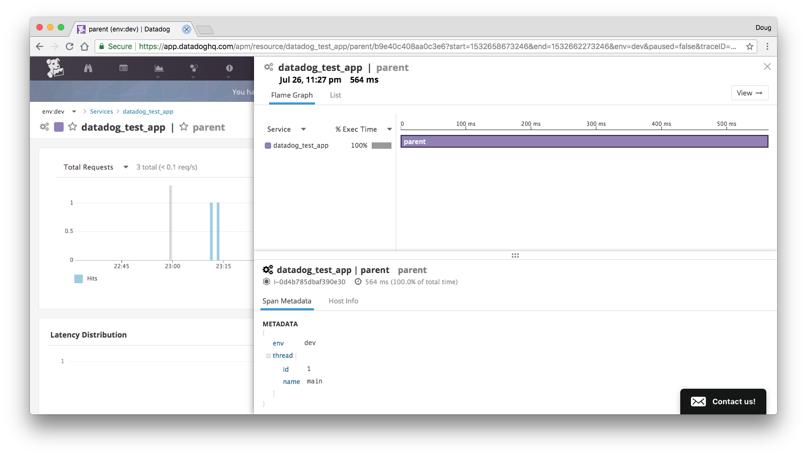

## Datadog Netty 4.0 Failing Test

This repo attempts to replicate [Netty40ClientTest](https://github.com/DataDog/dd-trace-java/blob/v0.11.0/dd-java-agent/instrumentation/netty-4.0/src/test/groovy/Netty40ClientTest.groovy) in a external setting.

Datadog fails to produce a child `netty.client.request` span which should be attached by [HttpClientRequestTracingHandler](https://github.com/DataDog/dd-trace-java/blob/v0.11.0/dd-java-agent/instrumentation/netty-4.0/src/main/java/datadog/trace/instrumentation/netty40/client/HttpClientRequestTracingHandler.java#L36), or append the `x-datadog-trace-id`, `x-datadog-parent-id` headers to the HTTP request.

### Reproduce
The following forks a new jvm with the datadog -javaagent attached, and runs [DatadogTestApp](src/main/scala/com/rallyhealth/datadog/DatadogTestApp.scala) with the javaOptions defined in [build.sbt](build.sbt).
```
sbt run
```

### Screenshot
https://app.datadoghq.com/apm/resource/datadog_test_app/parent/b9e40c408aa0c3e6?start=1532658673246&end=1532662273246&env=dev&paused=false&traceID=9070181112238314241&spanID=433366822666118501


